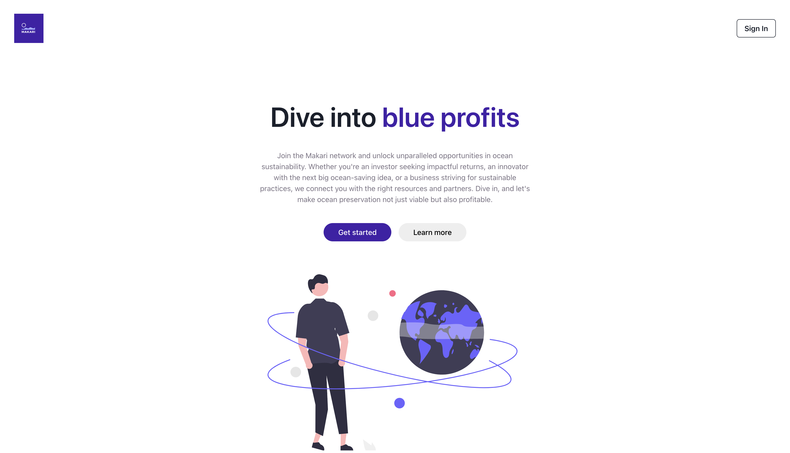

# Start your voyage with Makari

Welcome to **Makari** – the platform that connects ocean-conscious investors, innovative creators, and eco-aware businesses in a mutual voyage for oceanic well-being and economic growth.

### Overview 🌊

An economic voyage guided by AI agents for ocean-friendly investors, innovators, and businesses.

### Key Features

**AI Chatbot Assistant:** Engage with our state-of-the-art AI chatbot to set up and refine user profiles, ensuring every stakeholder is precisely represented and matched.

**Personal AI Agent:** Based on your profile – investor, innovator, or business – receive tailored guidance from your dedicated AI agent to help you navigate opportunities and challenges.

**Intelligent Matchmaking System:** Our advanced AI-driven algorithms identify and suggest potential collaborations between users, fostering a dynamic ecosystem where opportunities abound.

### Enter the Sea of Makari

**For Investors:**

- Discover sustainable ventures that not only promise returns but also contribute to ocean preservation.
- Use AI insights to identify potential profitable ventures aligned with ocean-friendly projects.

**For Innovators:**

- Gain visibility and connect with investors and businesses actively searching for ocean-friendly solutions.
- Leverage the AI-driven insights to refine pitches, optimize product offerings, and understand market dynamics.

**For Businesses:**

- Access a curated marketplace of sustainable, cost-effective solutions.
- Get matched with innovators offering products/services that resonate with your business's mission for ocean preservation.

### 💡 Industry & Market Insights

Makari is at the intersection of sustainability and commerce, where oceanic health meets profitable innovation.

**TAM:** Estimated at a whopping $6.069 billion.

**Annual Revenue Potential:** A promising $390.7 million, based on our targeted pricing strategies and the current market focus on sustainability.

Contact [invest@makari.company](mailto:invest@makari.company) for further market research details and calculations.

### 🔭 The Future with Makari

Our vision goes beyond numbers. While the TAM is a testament to the potential, our true north is the mission to coalesce economic growth with the ocean's health.

With a dedicated team, cutting-edge technology, and a community of ocean-conscious stakeholders, Makari is poised to create waves in the sustainable investment space.

Join us on this expedition. Let's make the oceans bluer, businesses greener, and investments brighter.

Interested in contributing or partnering with us? Feel free to reach out to [jackson@makari.company](mailto:jackson@makari.company) and let's embark on this exciting journey together!

[🔗 Makari's Official Website](https://makari.company)

[🔗 Investor Relations & Inquiries](mailto:invest@makari.company)

[🔗 Makari's Official Platform - Not Deployed Yet](https://github.com/makari-organization/MVP)

© 2023 Makari. All Rights Reserved.
