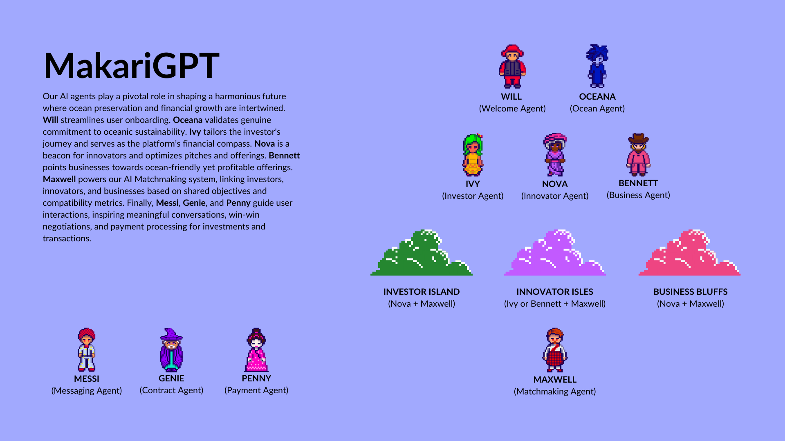

# Profits or Ocean Preservation? 🤔💸🌊

We know which answer most businesses choose, but why does it have to be this way? 

► Investors find it difficult to find profitable ventures that value ocean preservation.

► Innovators strive to align growth with ocean sustainability but often remain unseen.

► Businesses struggle to find cost-effective, ocean-friendly choices across industries.

## But, why can't we have both?

We must find a platform that bridges ocean preservation with profitability.

# Start your voyage on Makari

Welcome to **Makari** – a platform where ocean-friendly investors, innovators, and businesses set sail towards mutual prosperity and oceanic sustainability.

### Docking Station

Set sail on an economic voyage, where your deckhands, MakariGPT AI agents, lead you through the vast ocean of opportunities. Whether you're an investor, innovator, or business, the Makari ocean has an island waiting for you.

### Navigational Features

1. **Meet Will, the Welcoming Wharfmaster**: Before your voyage begins, dock with Will. He'll help set up your journey, refining your profile and ensuring your interests and intentions are clear as the coastal waters.

2. **Oceana, the Oceanic Oathkeeper**: Before setting out into the open sea, pledge your commitment to oceanic sustainability with Oceana. She ensures that your intentions align seamlessly with ocean preservation objectives.

3. **Sail with Your Trusted Deckhands**:
   - **Ivy, the Investment Inquirer**: For investors ready to discover sustainable and profitable ventures.
   - **Nova, the Navigator of Novelties**: For innovators eager to spotlight their ocean-friendly creations.
   - **Bennett, the Business Beacon**: For businesses scouting for sustainable, cost-effective solutions.

4. **Intelligent Island Matchmaking**: Helmed by the astute Maxwell, our AI-driven cartographer, chart a course towards recommended islands that brim with potential collaborations.

### Embark on the Makari Voyage

**For Investors:**
- **Destination**: Innovator Isles
  - Discover ocean-friendly ventures that promise not just returns but a salute to ocean preservation.
  - Harness Ivy's insights to identify ventures that harmoniously align profits with the oceans' well-being.

**For Innovators:**
- **Destination**: Investor Island & Business Bluffs
  - Shine the spotlight on your ocean-friendly innovations.
  - With Nova by your side, refine pitches, optimize product offerings, and fathom the depths of market dynamics.

**For Businesses:**
- **Destination**: Innovator Isles
  - Dive into a curated marketplace of ocean-friendly solutions.
  - Let Bennett guide you to innovators whose offerings resonate with your mission of ocean preservation.

Hoist your sails and set forth on a voyage that intertwines oceanic well-being with economic prosperity. Welcome aboard Makari!

### 💡 Industry & Market Insights

Makari is at the intersection of sustainability and commerce, where oceanic health meets profitable innovation.

**TAM:** Estimated at a whopping $6.069 billion.

**Annual Revenue Potential:** A promising $390.7 million, based on our targeted pricing strategies and the current market focus on sustainability.

Contact [invest@makari.company](mailto:invest@makari.company) for further market research details and calculations.

### 🔭 The Future with Makari

Our vision goes beyond numbers. While the TAM is a testament to the potential, our true north is the mission to coalesce economic growth with the ocean's health.

With a dedicated team, cutting-edge technology, and a community of ocean-conscious stakeholders, Makari is poised to create waves in the sustainable investment space.

Join us on this expedition. Let's make the oceans bluer, businesses greener, and investments brighter.

Interested in contributing or partnering with us? Feel free to reach out to [jackson@makari.company](mailto:jackson@makari.company) and let's embark on this exciting journey together!

[🔗 Makari's Official Website](https://makari.company)

[🔗 Investor Relations & Inquiries](mailto:invest@makari.company)

[🔗 Makari's Official Platform - Not Deployed Yet](https://github.com/makari-organization/MVP)

© 2023 Makari. All Rights Reserved.
